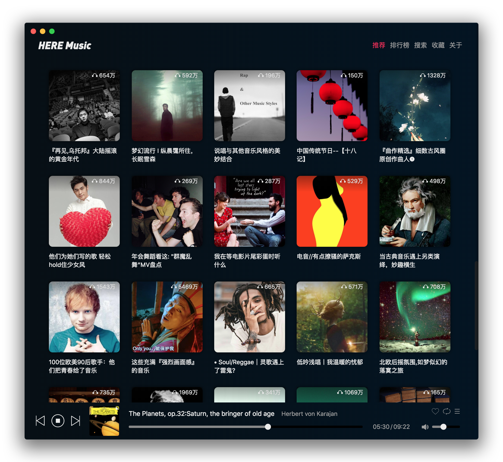
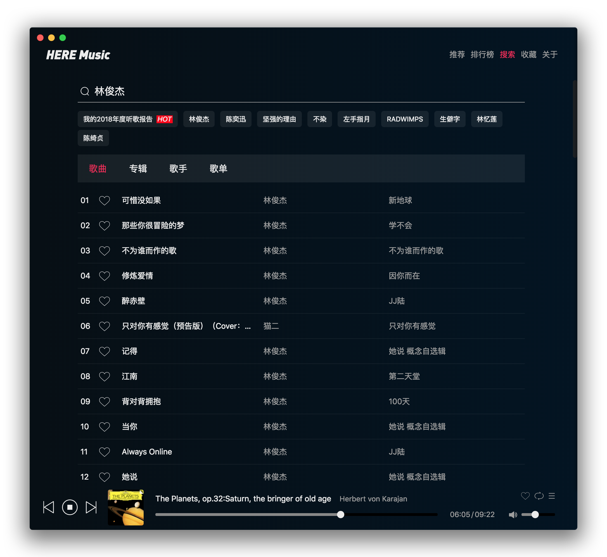
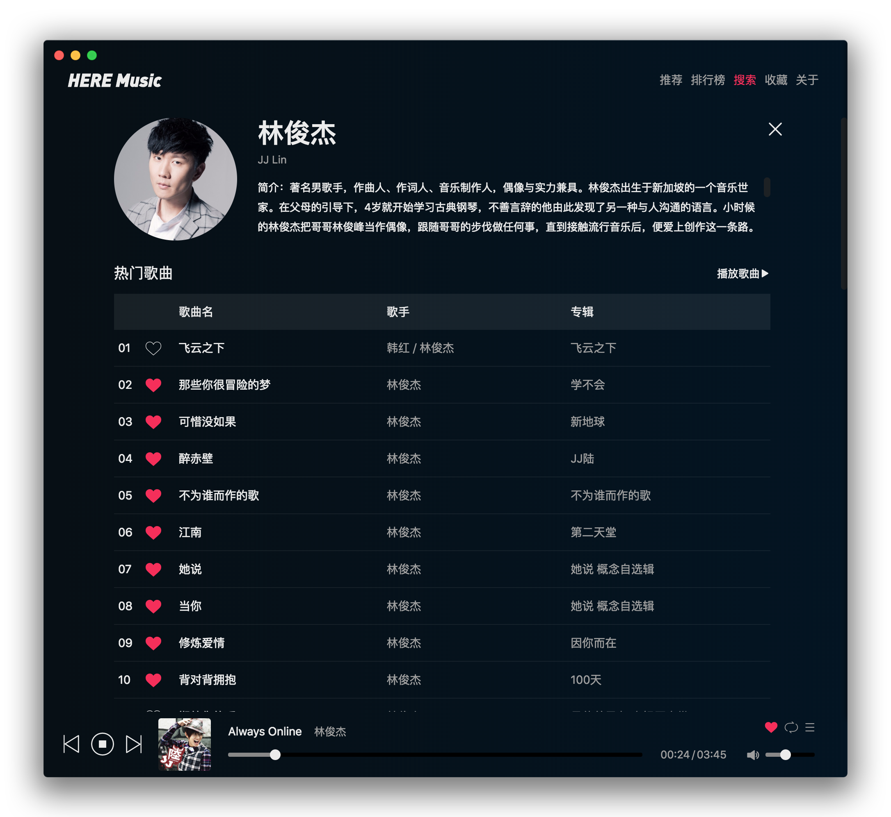
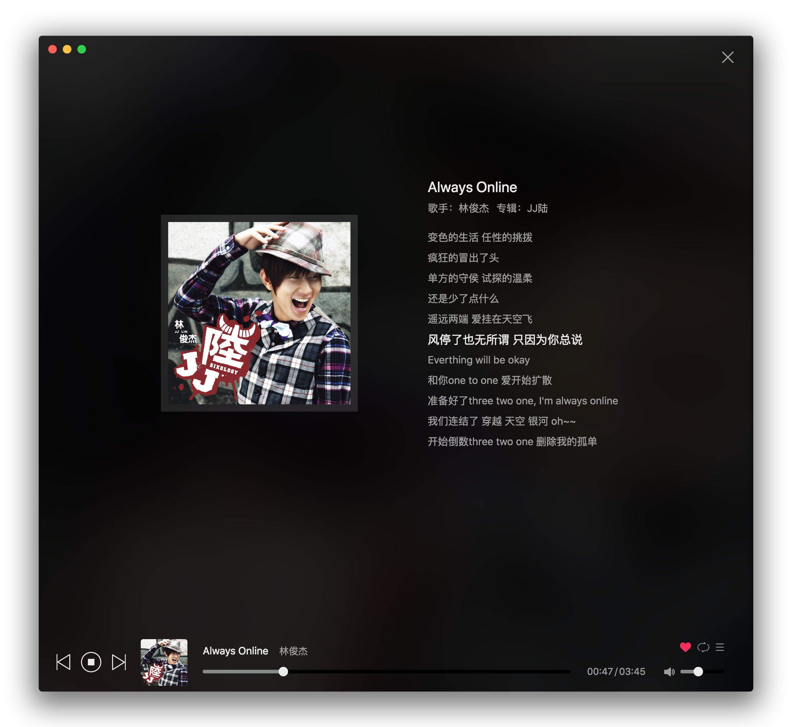
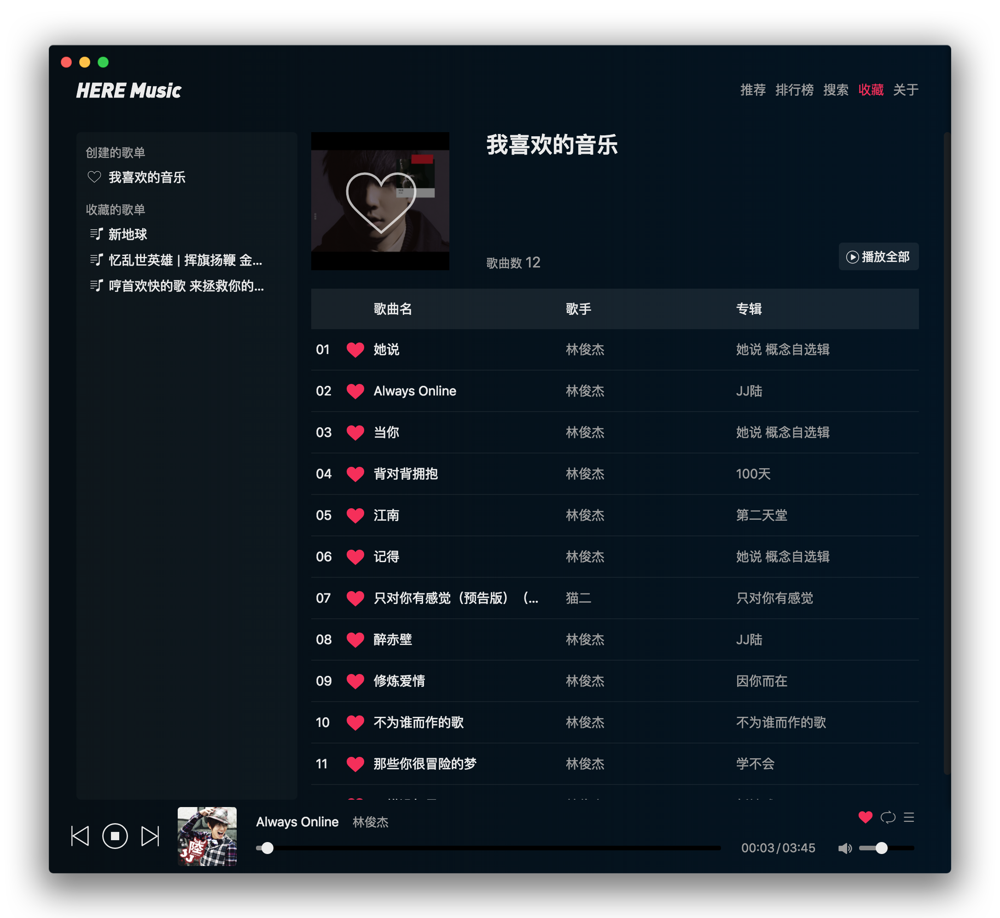

<p align="center">
  
</p>

<p align="center">
  <a href="https://github.com/caijinyc/Here/releases"></a>
  <a href="https://github.com/caijinyc/Here"></a>
  <a href="https://github.com/caijinyc/Here"></a>
  <a href="https://t.me/herechat"></a>
</p>

> 基于 Electron, React, Redux, Nedb 打造的一款简洁好用的桌面音乐播放器 👏

---

## 介绍
**HERE Music** 是基于 [Binaryify/NeteaseCloudMusicApi](https://github.com/Binaryify/NeteaseCloudMusicApi) 提供的网易云音乐 API ，使用 Electron、React、Redux、Nedb 开发的一款网易云音乐第三方。

特点是好看、简约、优雅、易用。目前发布了第一个版本，已经可以支撑日常的使用。

因为暂时只有我一个人在测试，所以可能会有一些没有被我发现的 Bug，大家在如果在使用的过程中发现 Bug，请在 issue 中告诉我，我会及时进行修复。

如果你对 HERE Music 的开发感兴趣的话，欢迎一起参与到项目的开发。

## 安装
**Mac**

[Download](https://github.com/caijinyc/Here/releases/download/v0.1.1/Here-0.1.1.dmg) the .dmg file.

因为之后一段时候需要复习春招，所以暂时只打包了 Mac 版本，其他平台之后会支持的，请给我点时间 😣。


## 预览

<p align="center">






</p>

## 快捷键

### 内置快捷键

Description            | Keys
-----------------------| -----------------------
暂停 / 播放              | <kbd>Space</kbd>
音量加                 | <kbd>Up</kbd>
音量减                 | <kbd>Down</kbd>
上一曲                 | <kbd>Cmd</kbd> + <kbd>Left</kbd>
下一曲                 | <kbd>Cmd</kbd> + <kbd>Right</kbd>
喜欢歌曲                 | <kbd>Cmd</kbd> + <kbd>L</kbd>
搜索                 | <kbd>Cmd</kbd> + <kbd>F</kbd>

### 全局快捷键

Description            | Keys
-----------------------| -----------------------
暂停 / 播放              | <kbd>Cmd / Ctrl</kbd> + <kbd>Option / Alt</kbd> +  <kbd>S</kbd>
音量加                 | <kbd>Cmd / Ctrl</kbd> + <kbd>Option / Alt</kbd> + <kbd>Up</kbd>
音量减                 | <kbd>Cmd / Ctrl</kbd> + <kbd>Option / Alt</kbd> +  <kbd>Down</kbd>
上一曲                 | <kbd>Cmd / Ctrl</kbd> + <kbd>Option / Alt</kbd> + <kbd>Left</kbd>
下一曲                 | <kbd>Cmd / Ctrl</kbd> + <kbd>Option / Alt</kbd> + <kbd>Right</kbd>

## 支持功能

- [x] 推荐歌单
- [x] 排行榜
- [x] 歌单展示
- [x] 歌曲详情
- [x] 歌词展示
- [x] 歌手详情
- [x] 播放列表
- [x] 喜欢歌曲
- [x] 收藏歌单
- [x] 播放模式切换
- [x] 收藏歌单
- [x] 搜索功能
- [x] 导入、导出收藏夹
- [x] 快捷键
- [x] 进度条展示
- [x] 进度跳转
- [x] 音量控制
- [x] 全局快捷键
- [ ] 喜欢歌曲分类

## 参与 HERE Music 的开发

如果有任何想法或需求，可以在 issue 中告诉我，同时欢迎各种 pull requests

个人的能力总是有限的，所以欢迎大家一起参与 HERE Music 的开发

**[参与贡献](./docs/CONTRIBUTING.md)**

### 参与讨论
1. [Telegram 讨论群](https://t.me/HereMusicChat)

### 开发项目

#### 运行

1. 将项目 clone 下来

```shell
$ git clone https://github.com/caijinyc/Here.git
$ cd Here
$ yarn

// 下载子模块
$ git submodule update --init --recursive
$ cd NeteaseCloudMusicApi
$ yarn
$ cd ..
```

2. 运行项目

```shell
// 运行 Electron
$ yarn electron-dev
```

#### 打包

1. 先使用 build 打包 react 得到 build 文件夹

```shell
$ yarn build
```

2. 打包成应用

```shell
$ yarn dist
```

## Author

**Here Music** © CaiJin, Released under the [MIT](https://github.com/caijinyc/Here/blob/master/LICENSE) License.

> [Blog](https://caijin.tech/blog) · GitHub [@caijinyc](https://github.com/caijinyc) · Telegram Channel [@KSIG](https://t.me/joinchat/FcnvjhQ610tZW73tbU8VUA)
